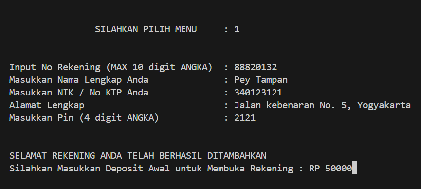
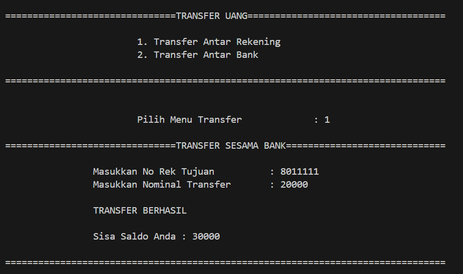
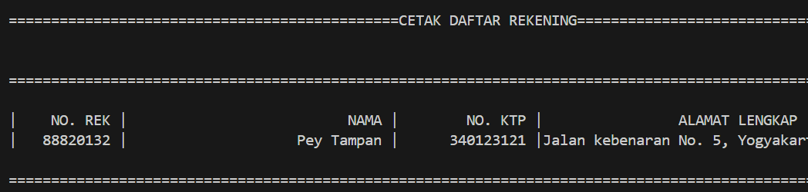

# cpp-simple-E-Banking

## Tentang Proyek

Proyek berbasis C++ yang dirancang untuk mensimulasikan algoritma transaksi sederhana pada sistem E-Banking. Proyek ini mencakup berbagai fungsi dasar yang digunakan dalam transaksi perbankan elektronik seperti pengecekan saldo, transfer dana, dan riwayat transaksi.

## Fitur Utama

- **Cek Saldo:** Menampilkan saldo rekening Anda saat ini.
- **Transfer Dana:** Transfer dana antar rekening dengan aman.

## Dokumentasi

Berikut adalah beberapa screenshot dari hasil running program:

### Cek Saldo

### Transfer Dana

### Riwayat Transaksi

